# Agentic_AI_Business_Intelligence_Assistant


## Project Overview

The Agentic AI Business Intelligence Assistant is an AI-powered business analytics application developed using Python, Streamlit, and Google's Gemini AI. The system analyzes retail business data, generates executive reports, provides strategic business recommendations, and answers natural language business queries to support data-driven decision making.

Unlike traditional dashboards, this application combines Business Intelligence with Generative AI, allowing users to interact with business data using natural language.

--

## Features

- Interactive Business Intelligence Dashboard
- Business KPI Analysis
- Category-wise Profit Analysis
- Region-wise Profit Analysis
- Business Health Score
- AI-generated Business Recommendations
- Executive Report Generation
- Downloadable Business Report
- Natural Language Business Assistant powered by Gemini AI
- Streamlit Web Application

---

## Technologies Used

- Python
- Streamlit
- Pandas
- Matplotlib
- Google Gemini AI
- Google Colab
- Visual Studio Code

---

## Project Workflow

1. Load and preprocess the Superstore dataset.
2. Perform exploratory data analysis.
3. Calculate business KPIs.
4. Analyze category and regional performance.
5. Generate business recommendations.
6. Create executive business reports.
7. Integrate Gemini AI for natural language business analysis.
8. Deploy the solution using Streamlit.

---

## Project Structure

```text
Agentic_AI_Business_Intelligence_Assistant/
│
├── streamlit_app.py
├── requirements.txt
├── Sample_Superstore.csv
├── README.md
├── Agentic_AI_Business_Intelligence_Assistant.ipynb
├── Executive_Report.txt
└── images/
```

---

## Dashboard Preview

### Dashboard Overview

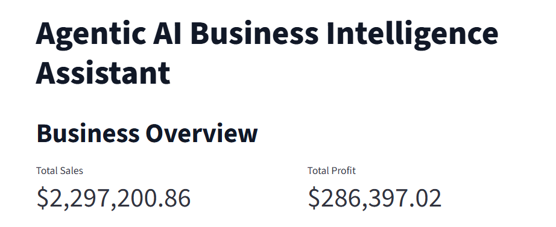

---

### Category Profit Analysis

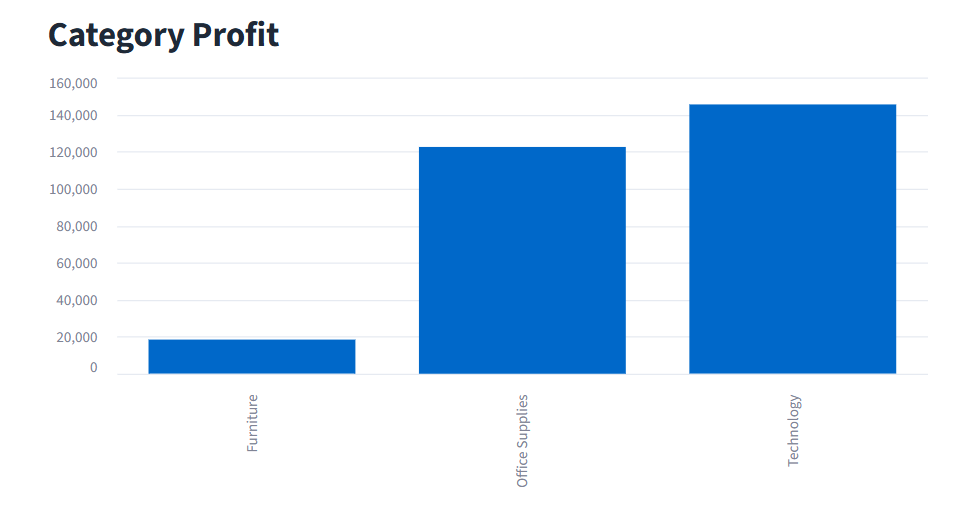

---

### Region Profit Analysis

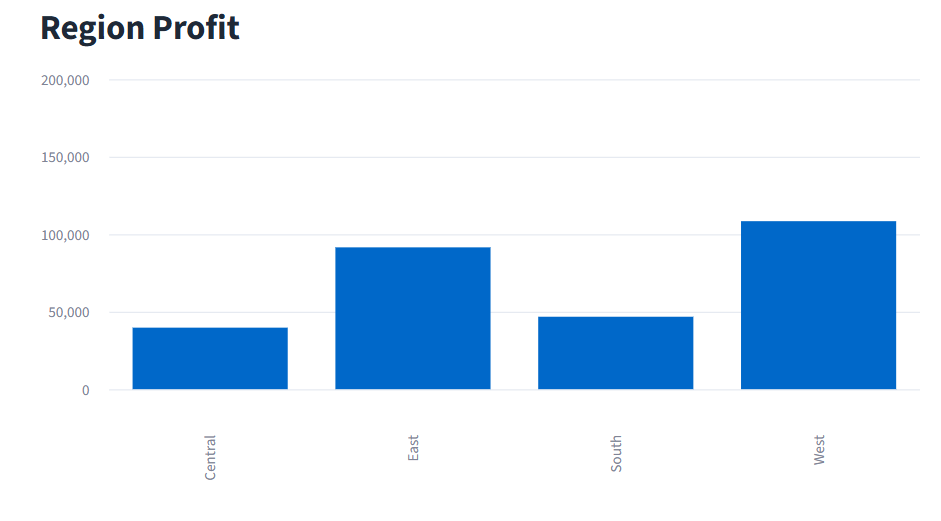

---

### Business Health Score

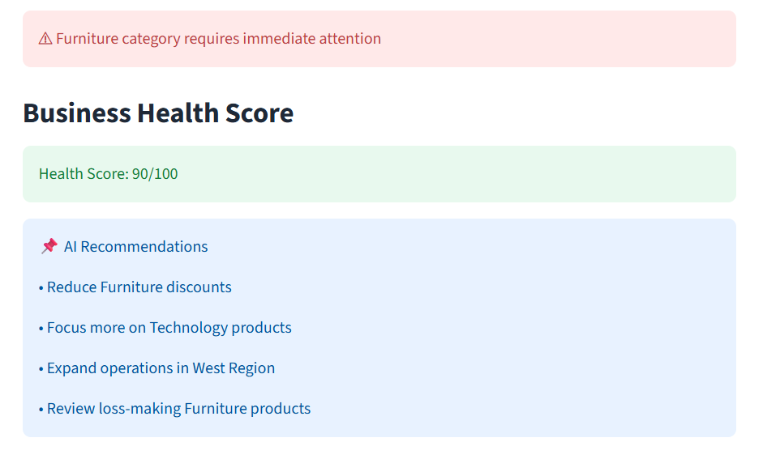

---

### AI Business Recommendations

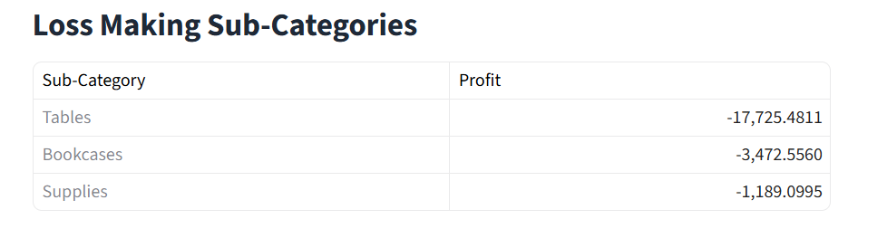

---

### Executive Report

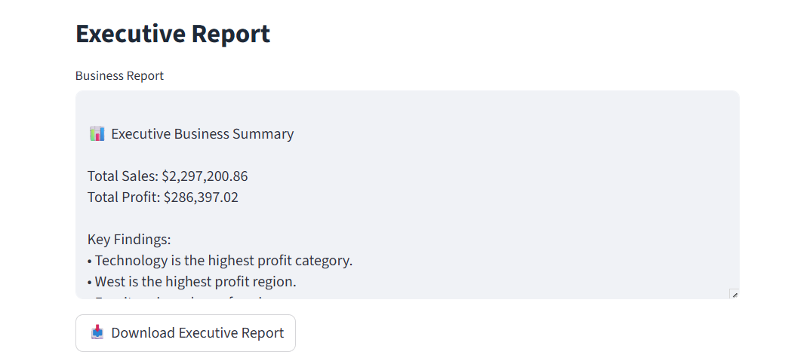

---

### AI Business Assistant

_Assistance.png)

---

### AI Question 1

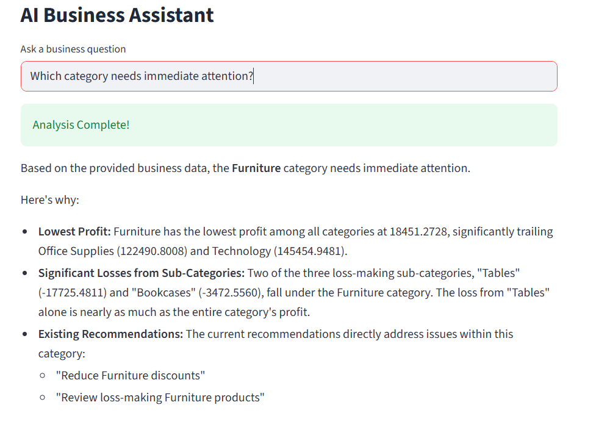

---

### AI Question 2

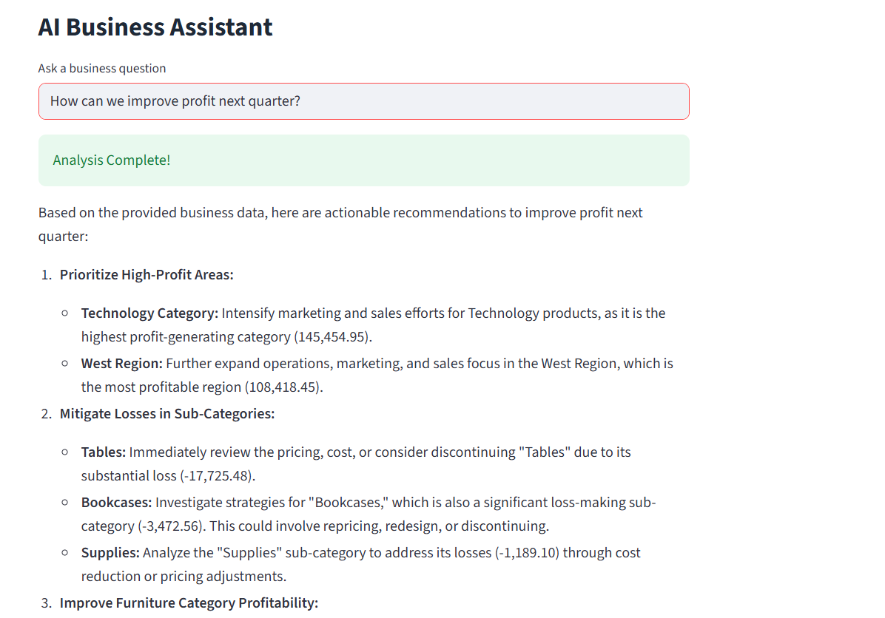
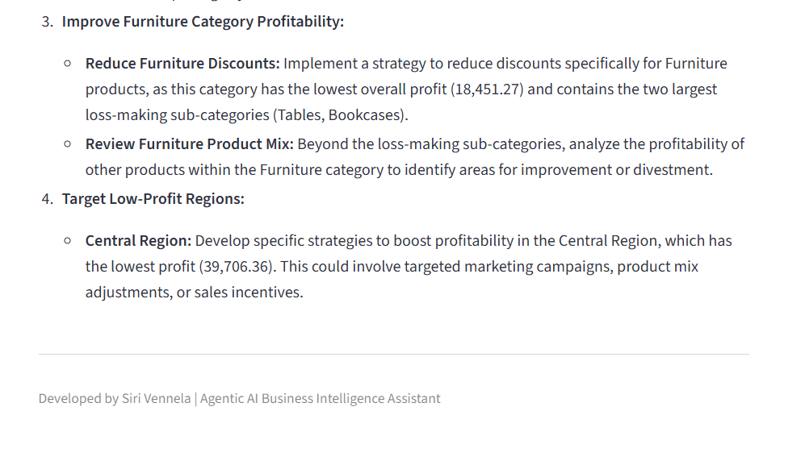

---

### AI Question 3

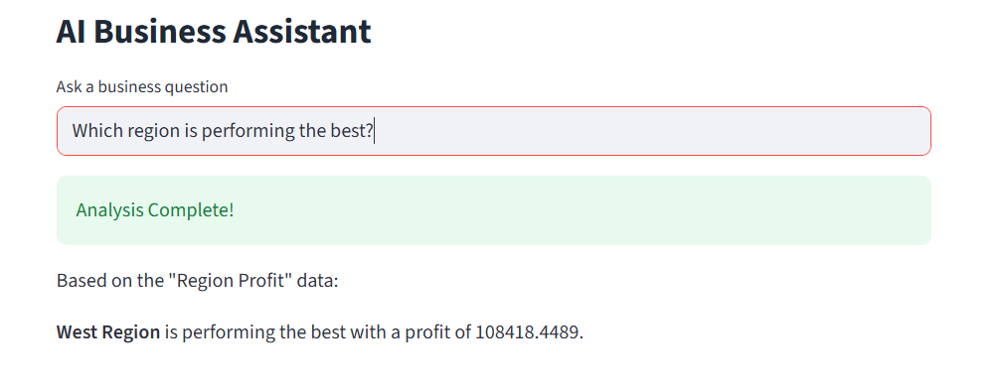

---

### AI Question 4

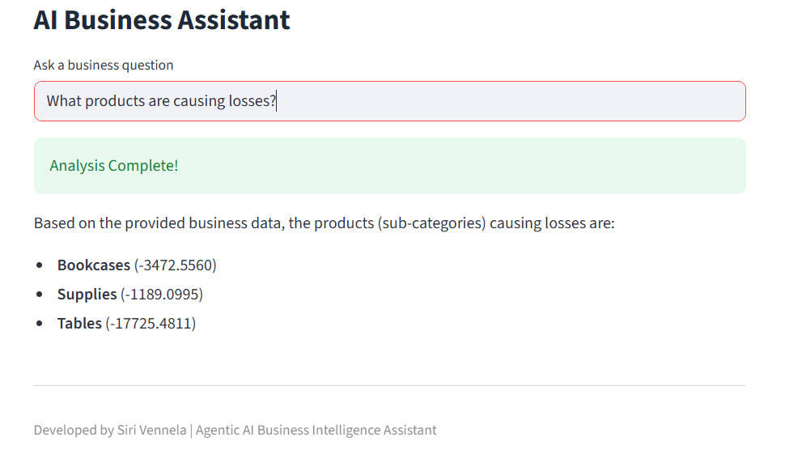

---

## Installation

Clone the repository.

```bash
git clone https://github.com/sirivennelamalli/Agentic_AI_Business_Intelligence_Assistant.git
```

Install the required packages.

```bash
pip install -r requirements.txt
```

Run the Streamlit application.

```bash
streamlit run streamlit_app.py
```

---

## Future Enhancements

- Support multiple business datasets
- Real-time business analytics
- Voice-based AI assistant
- Power BI integration
- Automated PDF report generation
- Predictive business analytics

---

## Author

**Siri Vennela**

B.Tech Computer and Communication Engineering

Amrita Vishwa Vidyapeetham
